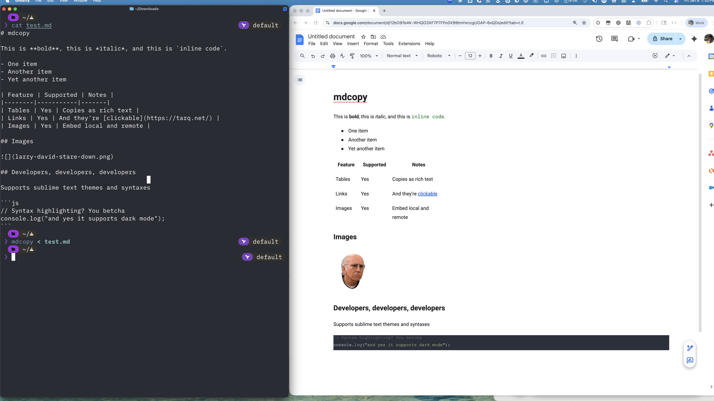
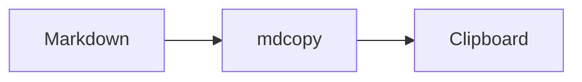

# mdcopy

A CLI tool that converts Markdown to clipboard with multiple formats (plain text and HTML), enabling rich-text pasting into applications like email clients, word processors, and note-taking apps.



## Why mdcopy?

When you copy Markdown text and paste it into applications like Gmail, Notion, or Word, you typically get the raw Markdown syntax rather than formatted text. mdcopy solves this by:

- Converting Markdown to rich text and copying it to your clipboard in multiple formats simultaneously (plain text, HTML)
- Allowing you to paste formatted content into virtually any application
- Embedding images directly in the clipboard so they paste inline
- Syntax highlighting code blocks with customizable themes
- Rendering mermaid diagrams as images inline

## Installation

### Homebrew (macOS)

```bash
brew install tarqd/tap/mdcopy
```

### Cargo (from source)

```bash
cargo install --path .
```

## Usage

```bash
# Read from stdin
echo "# Hello World" | mdcopy

# Read from file
mdcopy -i document.md

# Output to stdout
mdcopy -i document.md -o -
```

## CLI Options

| Option | Description |
|--------|-------------|
| `-i, --input <FILE>` | Input file (use `-` for stdin, default: stdin) |
| `-o, --output <FILE>` | Output to file or stdout (use `-` for stdout) |
| `-r, --root <DIR>` | Base directory for resolving relative image paths |
| `-e, --embed` | Embed all images (local and remote) |
| `-c, --config <FILE>` | Path to configuration file |
| `--strict` | Fail on errors instead of graceful fallback |
| `-v, --verbose` | Increase logging verbosity (`-v`, `-vv`, `-vvv`) |
| `-q, --quiet` | Suppress all output except errors |

### Syntax Highlighting Options

| Option | Description |
|--------|-------------|
| `--highlight` | Enable/disable syntax highlighting (default: enabled) |
| `--highlight-theme <NAME>` | Theme to use (default: `base16-ocean.dark`) |
| `--highlight-themes-dir <DIR>` | Custom themes directory |
| `--highlight-syntaxes-dir <DIR>` | Custom syntaxes directory |
| `--list-themes` | List available themes and exit |

### Mermaid Options

| Option | Description |
|--------|-------------|
| `-m, --mermaid` | Render mermaid diagrams as images (default: enabled) |
| `--mermaid-format <FORMAT>` | Output format: `svg`, `png`, `jpeg` (default: `png`) |
| `--mermaid-optimize` | Optimize rasterized output |
| `--mermaid-max-width <PX>` | Max rasterization width (default: 1200) |
| `--mermaid-max-height <PX>` | Max rasterization height (default: 800) |

## Features

### Markdown Support

Supports GitHub Flavored Markdown (GFM) including:
- Headings, paragraphs, and text formatting (bold, italic, strikethrough)
- Code blocks with syntax highlighting and inline code
- Ordered and unordered lists
- Blockquotes and horizontal rules
- Links and images
- Tables with column alignment

### Mermaid Diagrams

Mermaid code blocks are rendered as images and embedded directly in the clipboard output. This means flowcharts, sequence diagrams, ERDs, and other mermaid diagrams paste as images into Google Docs, email, Notion, and other apps.

````markdown

````

- Renders to SVG internally using [mermaid-rs](https://github.com/zed-industries/mermaid-rs-renderer), then rasterizes to PNG/JPEG at 2x for HiDPI
- Configure format, max dimensions, and optimization via CLI flags or config file
- Gracefully falls back to a code block if rendering fails (unless `--strict` is set)

### Syntax Highlighting

Code blocks are syntax highlighted using the [syntect](https://github.com/trishume/syntect) library with `base16-ocean.dark` as the default theme.

- Supports 50+ programming languages out of the box
- Use `--list-themes` to see available themes
- Add custom themes (`.tmTheme` files) to `~/.config/mdcopy/themes/`
- Add custom syntax definitions to `~/.config/mdcopy/syntaxes/`
- Configure language aliases (e.g., map `jsx` to `JavaScript`)

### Image Embedding

Images can be embedded as base64 data URLs in HTML output.

**Embedding modes:**
- `--embed-local` (default): Embed only local/relative images
- `--embed` / `-e`: Embed both local and remote images (fetches remote images)
- `--no-embed` / `-E`: Don't embed any images, keep original URLs

### Multi-Format Clipboard

When outputting to clipboard (default), mdcopy sets two formats simultaneously:
- **Plain text**: Original Markdown source
- **HTML**: Rendered HTML with embedded images and syntax highlighting

This allows pasting into virtually any application with appropriate formatting.

## MCP Server

mdcopy includes a built-in [Model Context Protocol](https://modelcontextprotocol.io) (MCP) server that exposes its rendering capabilities as tools for AI assistants. This lets AI agents copy formatted markdown and render diagrams on your behalf.

### Available Tools

| Tool | Description |
|------|-------------|
| `render_markdown_to_clipboard` | Render markdown to rich HTML and copy to the system clipboard. Accepts a file path or raw text. Supports image embedding and optimization. |
| `render_mermaid` | Render a mermaid diagram to an image file (SVG, PNG, or JPEG). Accepts source text or a file path. Useful for generating diagram assets. |

### Setup

#### Claude Code

```bash
claude mcp add mdcopy -- mdcopy mcp
```

#### Claude Desktop

Add to your Claude Desktop configuration (`claude_desktop_config.json`):

```json
{
  "mcpServers": {
    "mdcopy": {
      "command": "mdcopy",
      "args": ["mcp"]
    }
  }
}
```

#### Codex

```bash
codex mcp add mdcopy -- mdcopy mcp
```

Or add to `~/.codex/config.toml`:

```toml
[mcp_servers.mdcopy]
command = "mdcopy"
args = ["mcp"]
```

#### HTTP Transport

For remote or multi-client access, use the HTTP transport:

```bash
mdcopy mcp --transport http --listen 127.0.0.1:3100
```

The server will be available at `http://127.0.0.1:3100/mcp`.

## Configuration

mdcopy looks for a TOML configuration file at:
- **Linux**: `$XDG_CONFIG_HOME/mdcopy/config.toml` (default: `~/.config/mdcopy/config.toml`)
- **macOS**: `~/Library/Application Support/mdcopy/config.toml`, with fallback to `~/.config/mdcopy/config.toml` if the Application Support directory doesn't exist

Configuration precedence: CLI arguments > environment variables > config file > defaults

### Example Configuration

```toml
# Default settings
embed = "local"
strict = false

[highlight]
enable = true
theme = "base16-ocean.dark"

# Custom language mappings
[highlight.languages]
jsx = "JavaScript"
tsx = "TypeScript"

[mermaid]
embed = true
format = "png"
optimize = true
max_width = 1200
max_height = 800
```

### Environment Variables

All settings can be configured via environment variables with the `MDCOPY_` prefix:

- `MDCOPY_INPUT` - Input file path
- `MDCOPY_OUTPUT` - Output file path
- `MDCOPY_ROOT` - Base directory for images
- `MDCOPY_EMBED` - Embedding mode (all, local, none)
- `MDCOPY_STRICT` - Strict mode (true/false)
- `MDCOPY_HIGHLIGHT` - Enable highlighting (true/false)
- `MDCOPY_HIGHLIGHT_THEME` - Theme name
- `MDCOPY_HIGHLIGHT_THEMES_DIR` - Custom themes directory
- `MDCOPY_HIGHLIGHT_SYNTAXES_DIR` - Custom syntaxes directory

## Examples

```bash
# Convert README and copy to clipboard
mdcopy -i README.md

# Embed all images including remote ones
mdcopy -i doc.md --embed

# Skip image embedding entirely
mdcopy -i doc.md --no-embed

# Set custom base directory for relative image paths
mdcopy -i doc.md --root /path/to/images

# Use a specific syntax highlighting theme
mdcopy -i doc.md --highlight-theme "Solarized (dark)"

# List all available themes
mdcopy --list-themes

# Disable syntax highlighting
mdcopy -i doc.md --no-highlight

# Render mermaid diagrams as SVG instead of PNG
mdcopy -i doc.md --mermaid-format svg

# Fail on missing images instead of warning
mdcopy -i doc.md --strict

# Debug output
mdcopy -i doc.md -vv
```

## License

MIT
